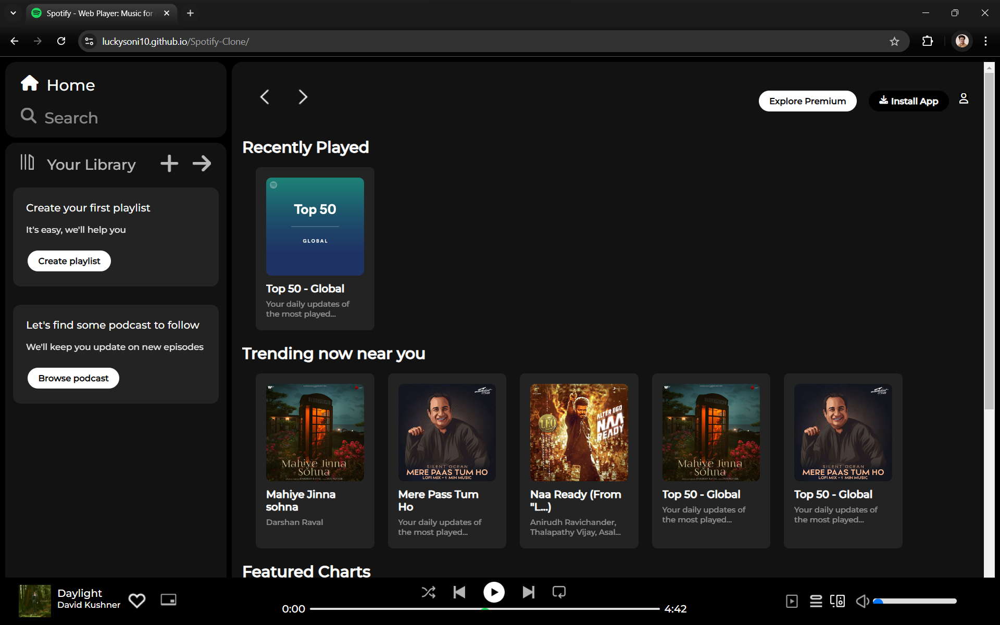

# 🎵 Spotify Clone

A **Spotify Clone** built using **HTML** and **CSS**. This project replicates the user interface of Spotify's web player with a focus on responsiveness and design aesthetics.

---

## 🌟 Features

- **Responsive Design**: Adapts to different screen sizes (desktop, tablet, mobile).
- **HTML5** and **CSS3** only: No JavaScript used, demonstrating pure CSS capabilities.
- **Pixel-Perfect Clone**: UI elements closely mimic Spotify’s original design.
- **Custom Music Controls**: Placeholder music control UI for play, pause, and volume adjustment.
- **Cross-browser Compatibility**: Tested on major browsers like Chrome, Firefox, and Edge.

---

## 🚀 Live Demo

Check out the live demo of the Spotify Clone here:

🔗 [Live Demo on GitHub Pages](https://luckysoni10.github.io/Spotify-Clone/)

---

## 📂 Project Structure

```bash
Spotify-Clone/
│
├── index.html        # Main HTML file
├── style.css         # Main stylesheet
└── images            # Images, icons, and other media assets


🛠️ Technologies Used
HTML5
CSS3
FontAwesome (for icons)
Google Fonts (for typography)


📸 Screenshots
Here’s a glimpse of the project:



📧 Contact
For any questions or suggestions, feel free to reach out:

Name: Lucky Soni
Email: sonilucky0005@gmail.com
LinkedIn: www.linkedin.com/in/luckysoni10
